# 🫘 Bean Jam Bot

---

## ✨ Features

### 🤖 AI-Powered Conversations
- **Google Gemini Pro** integration for intelligent, context-aware restaurant and dating spot recommendations
- Natural language understanding for planning dates, restaurant hopping sessions, or getting quick recommendations
- Conversation history tracking for coherent, multi-turn dialogues
- Smart itinerary planning assistance

### 🗺️ Restaurant & Dating Planning Intelligence
- Curates date ideas based on vibe (cozy, adventurous, budget, premium) and time of day
- Builds restaurant-hopping routes with proximity awareness and cuisine diversity
- Adjusts plans using live weather context (e.g., indoor/outdoor, sunset views)
- Bilingual recommendations (EN/JP) with culturally relevant suggestions

### 🎤 Advanced Voice Input
- **Google Cloud Speech-to-Text** integration with 48kHz WEBM_OPUS encoding
- Real-time voice transcription in **English** and **Japanese**
- Visual feedback during recording with reactive blob animation
- Automatic audio level detection and visualization with 8-band equalizer
- Helpful toast notifications guiding users through the recording process

### � Bilingual Support
- Seamless language switching between **English (EN)** and **Japanese (JP)**
- Language-specific AI prompts and responses
- Fully localized UI strings and error messages
- Cultural context awareness in recommendations

### 🌊 Dynamic Blob Animation
- **Organic, living blob** that reacts to user interactions
- Voice-reactive animation with real-time audio level visualization
- Smooth state transitions between idle and active modes
- Different visual modes:
  - **Normal Mode**: Teal/blue gradient for standard conversations
  - **Create Mode**: Purple/pink gradient when AI is generating responses
- Gradual rotation and morphing effects
- Adjustable blur and saturation based on activity
- Hardware-accelerated animations for smooth 60fps performance

### 🌤️ Weather Integration
- **Context-aware weather detection** - Gemini AI decides when to show weather cards
- Real-time weather data from **WeatherAPI.com**
- Multi-day forecast support (current + up to 7 days)
- Location-based recommendations using browser geolocation
- IP-based fallback using OpenStreetMap for reverse geocoding
- Beautiful weather card UI with temperature, conditions, and forecasts

### 🎨 Modern UI/UX
- **Brutalist design** aesthetic with bold borders and sharp edges
- Glassmorphism chat panel with adjustable transparency
- Smooth animations and transitions (1s opacity fades, 0.8s transforms)
- Custom scrollbar styling for chat history
- Responsive layout optimized for all screen sizes
- Brutalist shadow effects for depth
- Audio level equalizer overlay during voice input

### 🏗️ Architecture (Production - Full Serverless)

```mermaid
flowchart TD
    Browser["<b>Browser Client</b><br/>React + Vite UI • Voice (MediaRecorder) • Blob Animation • EN/JP"]
    
    Browser -->|Audio| Gateway
    Browser -->|Chat| Gateway
    Browser -->|Weather| Gateway
    
    Gateway["<b>AWS API Gateway (HTTP API)</b><br/>CORS @ Edge • Payload Format v2.0<br/><br/>/transcribe    /gemini    /weather"]
    
    Gateway --> L1
    Gateway --> L2
    Gateway --> L3
    
    L1["<b>Lambda: Transcribe</b><br/>Node 20"]
    L2["<b>Lambda: Gemini</b><br/>Node 20"]
    L3["<b>Lambda: Weather</b><br/>Node 20"]
    
    L1 --> API1
    L2 --> API2
    L3 --> API3
    
    API1["<b>Google Cloud</b><br/>Speech-to-Text (v2)"]
    API2["<b>Google Gemini</b><br/>Generative Language API"]
    API3["<b>WeatherAPI</b><br/>Forecast API"]
    
    style Browser fill:#5B9BD5,stroke:#2E5C8A,stroke-width:4px,color:#fff,font-weight:bold
    style Gateway fill:#70AD47,stroke:#507E32,stroke-width:4px,color:#fff,font-weight:bold
    style L1 fill:#FFC000,stroke:#C09000,stroke-width:3px,color:#000,font-weight:bold
    style L2 fill:#FFC000,stroke:#C09000,stroke-width:3px,color:#000,font-weight:bold
    style L3 fill:#FFC000,stroke:#C09000,stroke-width:3px,color:#000,font-weight:bold
    style API1 fill:#9966FF,stroke:#7744CC,stroke-width:3px,color:#fff,font-weight:bold
    style API2 fill:#9966FF,stroke:#7744CC,stroke-width:3px,color:#fff,font-weight:bold
    style API3 fill:#9966FF,stroke:#7744CC,stroke-width:3px,color:#fff,font-weight:bold
```



**Architecture Benefits:**
- ✅ **API keys secured server-side** (never exposed to client)
- ✅ **Single CORS point** at API Gateway (no duplicate headers)
- ✅ **Auto-scaling** with Lambda cold-start < 500ms
- ✅ **Cost-efficient** (pay-per-request, ~$0.20/million requests)
- ✅ **Unified monitoring** via CloudWatch Logs & Metrics

**High-Level Overview:**

```mermaid
flowchart TB
    Client[Browser Client<br/>React + Vite UI<br/>Voice • Blob • EN/JP]
    
    Client -->|Audio| Gateway
    Client -->|Chat| Gateway
    Client -->|Weather| Gateway
    
    Gateway[AWS API Gateway<br/>HTTP API<br/>CORS @ Edge]
    
    Gateway -->|/transcribe| L1[Lambda<br/>Transcribe<br/>Node 20]
    Gateway -->|/gemini| L2[Lambda<br/>Gemini<br/>Node 20]
    Gateway -->|/weather| L3[Lambda<br/>Weather<br/>Node 20]
    
    L1 --> STT[Google Cloud<br/>Speech-to-Text]
    L2 --> GEM[Google Gemini<br/>API]
    L3 --> WEA[WeatherAPI<br/>Forecast]
    
    style Client fill:#3b82f6,stroke:#1e40af,color:#fff
    style Gateway fill:#10b981,stroke:#059669,color:#fff
    style L1 fill:#f59e0b,stroke:#d97706,color:#fff
    style L2 fill:#f59e0b,stroke:#d97706,color:#fff
    style L3 fill:#f59e0b,stroke:#d97706,color:#fff
    style STT fill:#8b5cf6,stroke:#7c3aed,color:#fff
    style GEM fill:#8b5cf6,stroke:#7c3aed,color:#fff
    style WEA fill:#8b5cf6,stroke:#7c3aed,color:#fff
```



**Detailed Architecture:**

```mermaid
flowchart TD
    subgraph Client[Browser Client - React + Vite]
      UI[Chat UI<br/>EN/JP Toggle]
      MIC[Voice Recorder<br/>MediaRecorder]
      BLOB[Blob Animation<br/>Audio Reactive]
    end
    
    subgraph AWS[AWS Cloud - eu-north-1]
      APIGW[API Gateway HTTP API<br/>CORS @ Edge Layer]
      
      subgraph Lambdas[Lambda Functions - Node.js 20]
        L1[BeanJamTranscribe<br/>512MB • 30s timeout]
        L2[BeanJamGemini<br/>256MB • 15s timeout]
        L3[BeanJamWeather<br/>256MB • 15s timeout]
      end
    end
    
    subgraph External[External APIs]
      STT[Google Cloud<br/>Speech-to-Text v2]
      GEMINI[Google Gemini<br/>2.5 Flash API]
      WEATHER[WeatherAPI.com<br/>Forecast JSON]
    end
    
    MIC -->|webm/opus audio| UI
    UI -->|POST /transcribe| APIGW
    UI -->|POST /gemini| APIGW
    UI -->|POST /weather| APIGW
    
    APIGW -->|v2.0 payload| L1
    APIGW -->|v2.0 payload| L2
    APIGW -->|v2.0 payload| L3
    
    L1 -->|recognize| STT
    L2 -->|generateContent| GEMINI
    L3 -->|forecast.json| WEATHER
    
    STT -.transcript.-> L1
    GEMINI -.response.-> L2
    WEATHER -.forecast.-> L3
    
    L1 -.JSON.-> APIGW
    L2 -.JSON.-> APIGW
    L3 -.JSON.-> APIGW
    
    APIGW -.response.-> UI
    UI --> BLOB
```



## 🚀 Technology Stack

| Category | Technology |
|----------|-----------|
| **Frontend** | React 18, TypeScript, Vite |
| **UI Framework** | Tailwind CSS, Shadcn/ui, Radix UI |
| **State Management** | React Context API, TanStack Query |
| **Routing** | React Router |
| **AI Services** | Google Gemini 2.5 Flash, Google Cloud Speech-to-Text |
| **APIs** | WeatherAPI.com, OpenStreetMap Nominatim |
| **Backend (Dev)** | Node.js, Express |
| **Backend (Prod)** | AWS API Gateway (HTTP) + AWS Lambda (Node.js 20) |
| **Animation** | CSS Keyframes, RequestAnimationFrame, Web Audio API |
| **Deployment** | AWS Lambda/API Gateway, Docker (optional) |

## 📁 Project Structure

```
bean-jam-bot/
├── aws-lambda/
│   ├── transcribe/              # AWS Lambda: Audio → Text
│   │   ├── index.js             # Google Cloud STT handler
│   │   ├── package.json
│   │   └── function.zip         # Deployment artifact
│   ├── gemini/                  # AWS Lambda: AI Chat Proxy
│   │   ├── index.js             # Gemini API proxy handler
│   │   └── function.zip
│   └── weather/                 # AWS Lambda: Weather Proxy
│       ├── index.js             # WeatherAPI.com proxy handler
│       └── function.zip
├── server/                      # Local development server (optional)
│   └── index.js
├── src/
│   ├── components/
│   │   ├── ui/                 # Shadcn/ui components
│   │   ├── BlobAnimation.tsx   # 🌊 Voice-reactive blob
│   │   ├── ChatMessage.tsx     # Chat bubble component
│   │   ├── WeatherCard.tsx     # Weather display card
│   │   └── LanguageToggle.tsx  # EN/JP switcher
│   ├── contexts/
│   │   └── useLanguage.tsx     # Language context
│   ├── hooks/
│   │   ├── use-audio-recorder.ts  # 🎤 Voice recording
│   │   ├── use-audio-level.ts     # Audio visualization
│   │   └── use-toast.ts
│   ├── lib/
│   │   ├── gemini.ts           # Gemini API client
│   │   ├── location.ts         # Geolocation service
│   │   ├── weather.ts          # Weather API client
│   │   └── utils.ts
│   ├── pages/
│   │   └── Index.tsx           # Main chat interface
│   ├── App.tsx
│   └── main.tsx
├── .env                         # Environment variables
└── Dockerfile                   # Docker containerization (optional)
```

## 🛠️ Installation & Setup

### Prerequisites

- Node.js v18+
- Google Cloud Platform account (for Speech-to-Text)
- Google Gemini API key
- WeatherAPI.com API key

### 1. Clone Repository

```bash
git clone https://github.com/Defalt-here/Bean-Jam-Bot.git
cd Bean-Jam-Bot
```

### 2. Install Dependencies

```bash
npm install
```

### 3. Configure Environment Variables

Create a `.env` file:

```env
# Google Cloud Speech-to-Text (absolute path to service account JSON)
GOOGLE_APPLICATION_CREDENTIALS=C:\path\to\your\service-account.json

# Google Gemini API Key
VITE_GEMINI_API_KEY=AIzaSy...

# WeatherAPI.com API Key
VITE_WEATHER_API_KEY=your_weatherapi_key

# AWS Lambda Endpoints (API Gateway HTTP API)
VITE_TRANSCRIBE_API_URL=https://<api-id>.execute-api.eu-north-1.amazonaws.com/transcribe
VITE_GEMINI_PROXY_URL=https://<api-id>.execute-api.eu-north-1.amazonaws.com/gemini
VITE_WEATHER_PROXY_URL=https://<api-id>.execute-api.eu-north-1.amazonaws.com/weather
```

### 4. Run Development Servers

**Terminal 1 - Backend Server:**
```bash
npm run start:server
# or use the PowerShell script:
.\start-server.ps1
```

**Terminal 2 - Frontend:**
```bash
npm run dev
```

Open `http://localhost:8080` in your browser! 🎉

## 🎮 Usage

### Text Chat
1. Type your message in the input field
2. Press Enter or click **SEND**
3. AI responds with restaurant/dating recommendations

### Voice Input
1. Click the **Mic** button
2. Grant microphone permissions
3. Speak your question (in English or Japanese)
4. Click **Stop** to transcribe
5. Message automatically sends to AI

### Language Switching
- Click the **EN** / **🇯🇵** toggle at the top
- Switches both UI and AI response language
- All prompts and responses adapt automatically

### Weather Queries
- Ask about weather: "What's the weather like?"
- AI automatically shows weather card with forecast
- Location-based using your IP or GPS

## 🌍 Deployment

### AWS (Production - Full Serverless)

#### 1️⃣ Package Lambda Functions

**Transcribe Lambda** (has dependencies):
```powershell
cd aws-lambda/transcribe
npm install --omit=dev
Compress-Archive -Path @("index.js","package.json","node_modules") -DestinationPath function.zip -Force
```

**Gemini & Weather Lambdas** (no dependencies, already packaged):
```powershell
# function.zip already exists in:
# aws-lambda/gemini/function.zip
# aws-lambda/weather/function.zip
```

#### 2️⃣ Create Lambda Functions

| Function Name | Runtime | Memory | Timeout | Env Vars |
|--------------|---------|--------|---------|----------|
| **BeanJamTranscribe** | Node.js 20.x | 512 MB | 30s | `GOOGLE_SERVICE_ACCOUNT_KEY` = your GCP service account JSON |
| **BeanJamGemini** | Node.js 20.x | 256 MB | 15s | `GEMINI_API_KEY` = your Gemini API key |
| **BeanJamWeather** | Node.js 20.x | 256 MB | 15s | `WEATHER_API_KEY` = your WeatherAPI key |

**Steps for each:**
1. Create Function → Author from scratch
2. Runtime: Node.js 20.x
3. Execution role: Use existing → `BeanJamTranscribeLambdaRole` (or create new with basic Lambda permissions)
4. Upload `function.zip` from Code tab
5. Configuration → Environment variables → Add key/value from table above
6. Configuration → General → Set Memory & Timeout

#### 3️⃣ Create API Gateway (HTTP API)

1. **Create API**
   - Type: HTTP API
   - Name: `BeanJamAPI`
   - Stage: `$default` (Auto-deploy: ON)
   - Region: `eu-north-1` (or your preferred region)

2. **Configure Routes**
   - Click **Routes** → **Create** for each:

   | Method | Path | Integration | Payload Format |
   |--------|------|-------------|----------------|
   | POST | `/transcribe` | Lambda: BeanJamTranscribe | 2.0 |
   | POST | `/gemini` | Lambda: BeanJamGemini | 2.0 |
   | POST | `/weather` | Lambda: BeanJamWeather | 2.0 |

3. **Configure CORS** (API-level)
   - Click **CORS** in left menu
   - Allow origins: `http://localhost:8080`
     - Add production domains later (comma-separated)
   - Allow methods: `POST,OPTIONS`
   - Allow headers: `content-type`
   - Max age: `3600`
   - ✅ **Critical**: Do NOT set CORS headers in Lambda code (already handled correctly)

4. **Deploy**
   - Toggle Auto-deploy OFF → ON to force refresh
   - Note your **Invoke URL**: `https://<api-id>.execute-api.eu-north-1.amazonaws.com`

5. **Permissions**
   - API Gateway will auto-add `lambda:InvokeFunction` permissions to each Lambda
   - Verify in Lambda → Configuration → Permissions → Resource-based policy statements

#### 4️⃣ Update Frontend Configuration

Edit `.env` with your API Gateway invoke URL:

```env
VITE_TRANSCRIBE_API_URL=https://k3i65afofi.execute-api.eu-north-1.amazonaws.com/transcribe
VITE_GEMINI_PROXY_URL=https://k3i65afofi.execute-api.eu-north-1.amazonaws.com/gemini
VITE_WEATHER_PROXY_URL=https://k3i65afofi.execute-api.eu-north-1.amazonaws.com/weather
```

Restart Vite dev server:
```powershell
npm run dev
```

Hard-refresh browser: `Ctrl+Shift+R` (Windows) or `Cmd+Shift+R` (Mac)

#### 6️⃣ Optional: Health Check & Monitoring

**Health Check Route:**
- API Gateway → Routes → Create → `GET /health`
- Integration: Mock response
- Response: `200` with body `{ "ok": true }`
- Use for uptime monitoring (Pingdom, UptimeRobot, etc.)

**CloudWatch Monitoring:**
- Lambda → Monitor → View CloudWatch logs
- API Gateway → Monitor → CloudWatch metrics
- Set alarms for 5XX errors, cold start duration, invocation counts


## 🎨 Blob Animation Technical Details

The blob animation is a sophisticated visual element that enhances user engagement:

- **Interpolated Loading States**: Smooth transitions using lerp (linear interpolation) with 0.05 speed
- **Audio Reactivity**: Real-time FFT analysis creates 8-band equalizer visualization
- **Dynamic Properties**:
  - Blur: 8-26px based on state
  - Saturation: 120-200% during activity
  - Rotation: 60s slow (idle) to 8s fast (loading)
  - Scale: Pulsing 1.0-1.08x
  - Movement: Sine/cosine wave patterns
- **Color Modes**:
  - Normal: `#3B82F6` → `#10B981` → `#22D3EE` (blue-teal)
  - Create: `#6366F1` → `#A855F7` → `#EC4899` (purple-pink)
- **Performance**: Hardware-accelerated with `will-change` transforms


## 📄 License

This project is open source and available under the MIT License.

## 🙏 Acknowledgments

- Google Gemini AI for conversational intelligence
- Google Cloud Speech-to-Text for voice recognition
- WeatherAPI.com for weather data
- Shadcn/ui for beautiful components
- The React and Vite communities

---

<div align="center">

**Made with 💜 by [Defalt-here](https://github.com/Defalt-here)**

*Bean Jam Bot - Where AI meets beautiful design* ✨

</div>

## 🧰 Troubleshooting (AWS)

- 405 Method Not Allowed
  - Ensure route `POST /transcribe` is attached to your Lambda integration
  - Toggle `$default` stage Auto-deploy OFF → ON to redeploy
  - Verify you’re calling `/transcribe` path (not base URL)

- CORS blocked (No/duplicate Access-Control-Allow-Origin)
  - Let API Gateway own CORS; remove `Access-Control-*` headers from Lambda
  - CORS in API: origins = your exact origin(s), methods = POST, headers = content-type

- Function URL vs API Gateway
  - Prefer API Gateway for production (auth, observability, routes)
  - If using Function URL temporarily, set CORS there and avoid duplicate headers in Lambda
