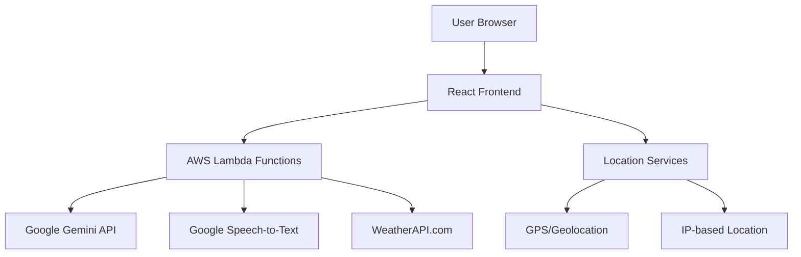
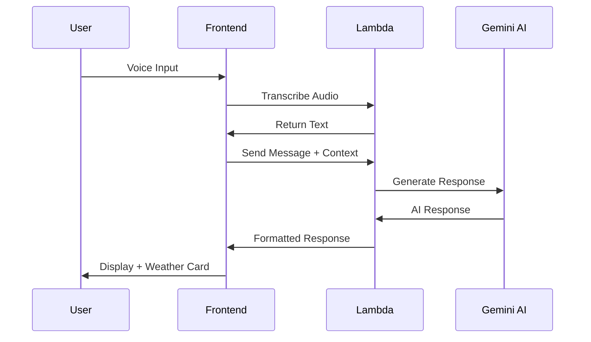
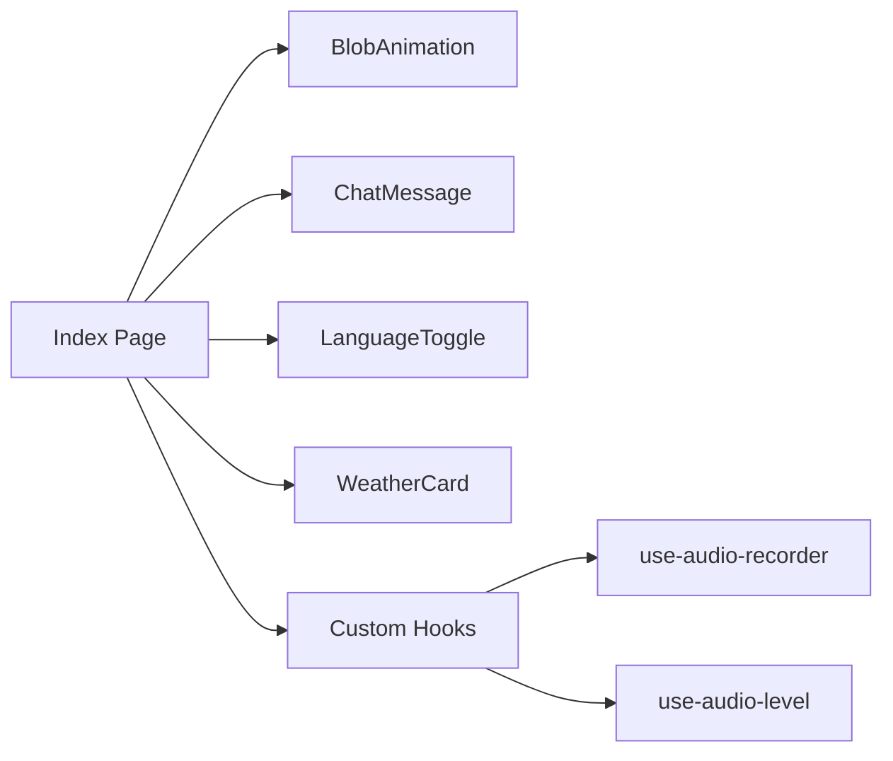
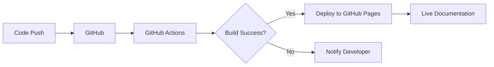
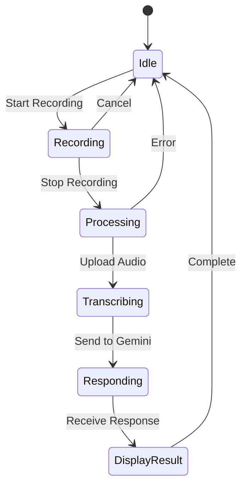
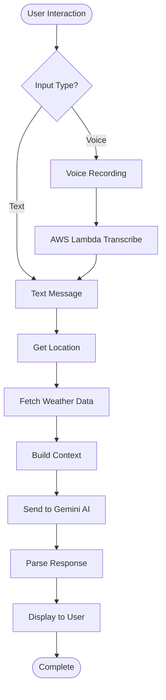
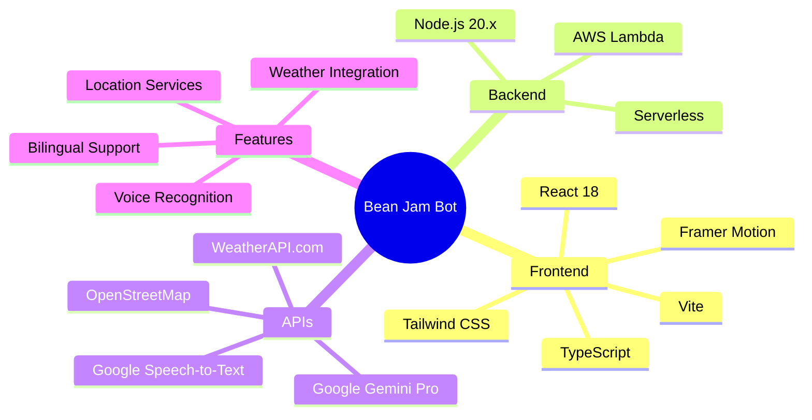
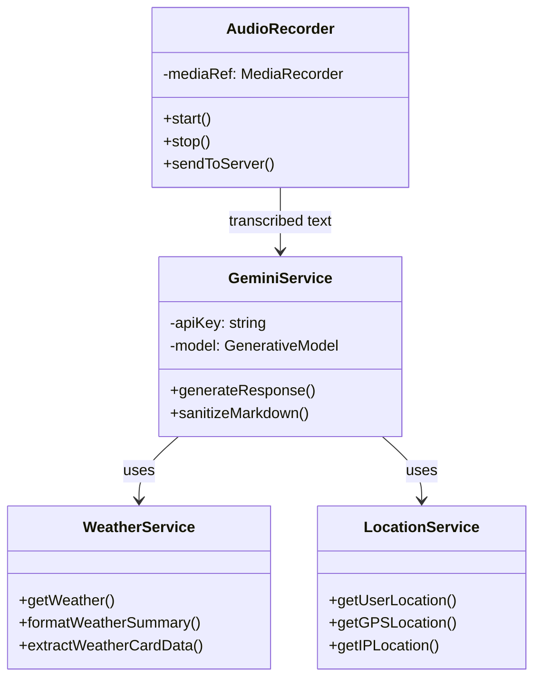
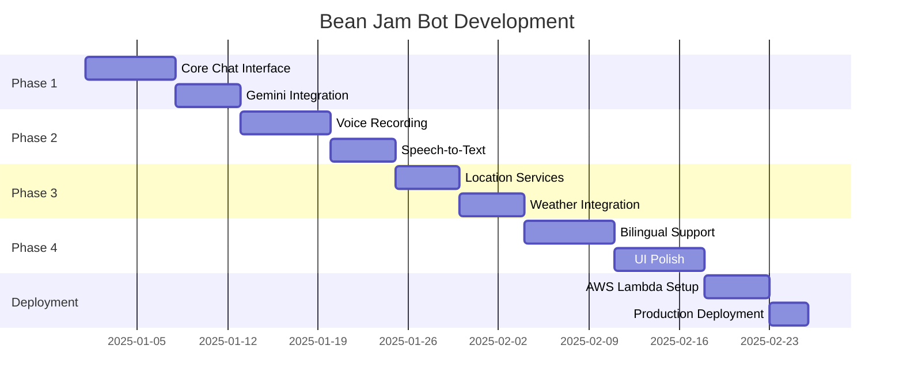
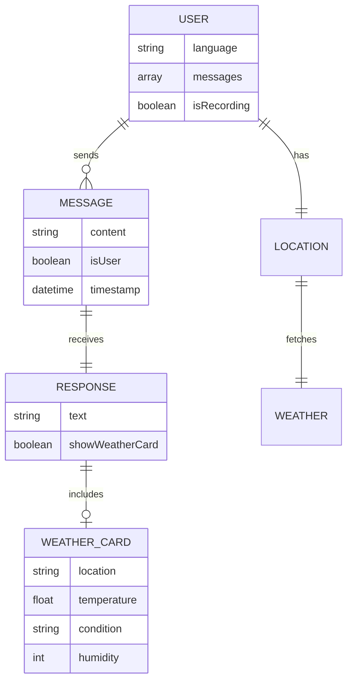

# Mermaid Diagram Examples

This page demonstrates various Mermaid diagrams supported in the documentation.

## System Architecture

## Request Flow

## Component Structure

## Deployment Pipeline

## State Management

## API Integration Flow

## Tech Stack

## Class Diagram

## Gantt Chart - Development Timeline

## Entity Relationship

---

**Note:** All these diagrams are rendered using Mermaid.js, which is now fully supported in the documentation!
